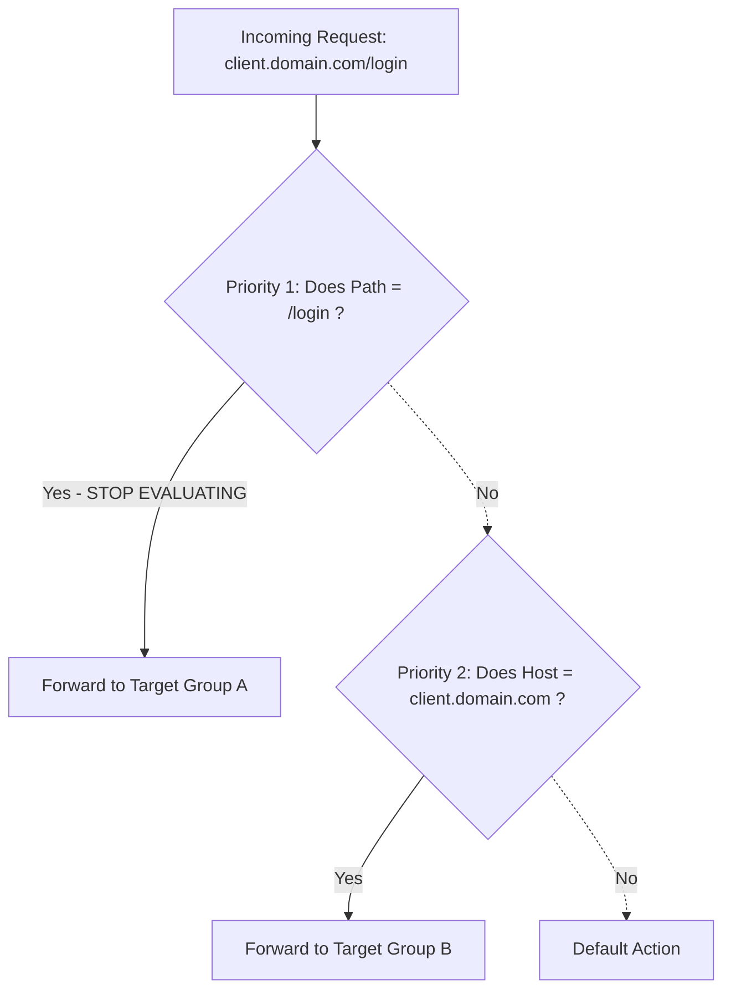

# AWS ALB Priority-Based Routing Guide

This guide focuses exclusively on how **Priority** works in AWS Application Load Balancers (ALB) and how to design your rule order to prevent traffic routing conflicts.

---

## 1. What is Priority-Based Routing?

In AWS ALB, every listener rule is assigned a number (Priority). 
* **1** is the highest priority (evaluated first).
* **50,000** is the lowest priority.
* **Default** is evaluated last (if absolutely no other rules match).

### The "Short-Circuit" Rule
The ALB evaluates incoming traffic from Top to Bottom (Priority 1 -> 2 -> 3). 
**As soon as the ALB finds a rule that matches, it stops.** It does not care if there is a "better" or "more accurate" rule further down the list. The first match wins, and the rest of the list is completely ignored.

---

## 2. The Golden Rule of Rule Ordering

When designing your ALB priorities, you must follow this Golden Rule:
> **The most SPECIFIC rules must have the HIGHEST priority (lowest numbers).**
> **The most GENERIC rules must have the LOWEST priority (highest numbers).**

### Why? The Path vs. Host Conflict
A Path condition (e.g., `Path = /login`) is incredibly generic because it applies to **every single subdomain** pointing to your load balancer. 

If you put a generic Path rule at Priority 1, it acts like a giant net. It will accidentally catch traffic intended for your subdomains.

#### ❌ Bad Priority Design (What caused your issue)
1. **Priority 1 (Generic):** `Path = /login`
2. **Priority 2 (Specific):** `Host = client.xrdashboard.com`

*Result:* A user goes to `client.xrdashboard.com/login`. Priority 1 grabs it immediately because it sees `/login`. Priority 2 is ignored. Traffic goes to the wrong app.

#### ✅ Good Priority Design
1. **Priority 1 (Specific):** `Host = client.xrdashboard.com`
2. **Priority 2 (Generic):** `Path = /login`

*Result:* A user goes to `client.xrdashboard.com/login`. Priority 1 grabs it because the domain matches. A user goes to `xrdashboard.com/login`. Priority 1 ignores it (wrong domain), Priority 2 grabs it. Traffic goes exactly where it belongs!

---

## 3. Best Practice: The Priority Tier System

To keep your ALB organized as your architecture grows, do not number your rules 1, 2, 3. Leave gaps (e.g., 10, 20, 30) so you can insert new rules later without having to reorder everything.

Here is an industry-standard template for ALB priorities:

| Priority Range | Rule Type | Example Condition | Why it goes here |
| :--- | :--- | :--- | :--- |
| **1 - 10** | **Emergency / Overrides** | `Path = /maintenance` | Must override everything else during an outage. |
| **11 - 50** | **Specific Subdomains** (Client Portals, APIs) | `Host = api.domain.com` or `Host = client.domain.com` | Traps subdomain traffic immediately so generic path rules don't steal it. |
| **51 - 100** | **Compound Rules** (Host + Path) | `Host = domain.com` AND `Path = /login` | Very specific combination for your main application. |
| **101 - 200** | **Generic Path Rules** | `Path = /api/*` or `Path = /assets/*` | Broad catch-alls that only apply if no specific subdomain claimed the traffic. |
| **Default** | **Main Application / Landing Page** | *If no rules match* | The absolute fallback (usually your main UI or website). |

### Summary
Always ask yourself: *"Could this rule accidentally catch traffic meant for something else?"* If the answer is yes, lower its priority (give it a higher number) and put your specific rules above it.
